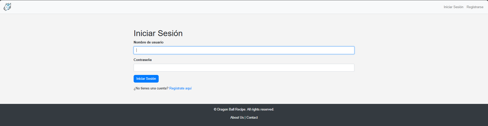
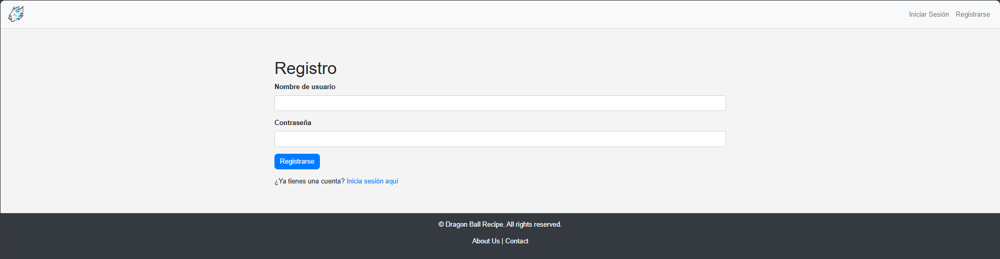
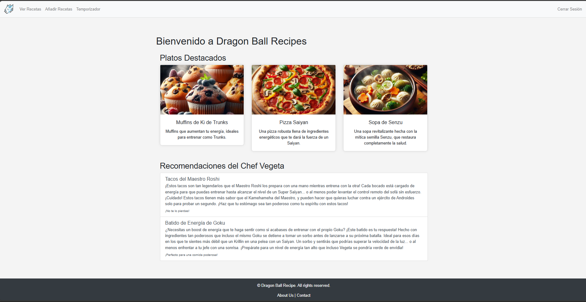
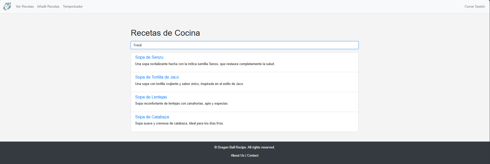
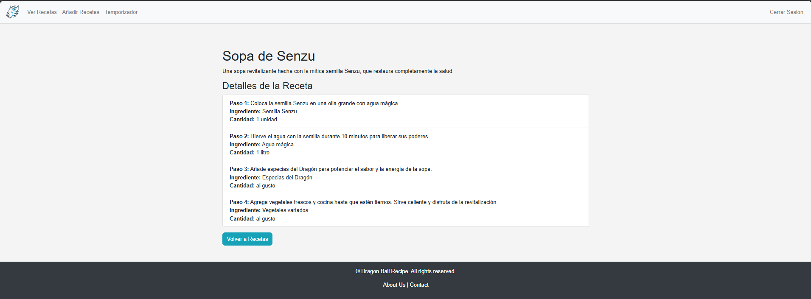
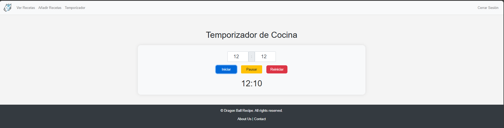
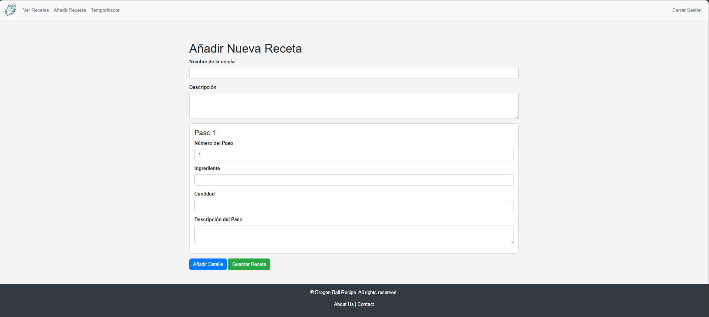
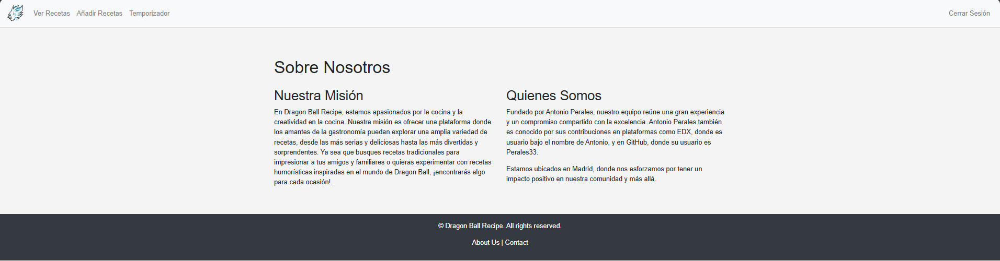
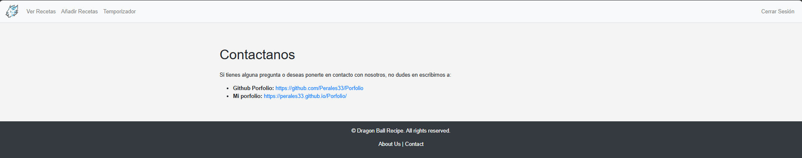

# CS50 Final Project - Dragon Ball Recipes
## Video de Demostración

[Ver el Video de Demostración](https://youtu.be/q6WRHR1DMQ4)

## Demo en Vivo

[Visitar la Aplicación en Vivo](https://dragon-ball-recipes.onrender.com)

---

## Tabla de Contenidos

- [Descripción](#descripción)
- [Detalles de las Funcionalidades](#detalles-de-las-funcionalidades)
- [Tecnologías](#tecnologías)
- [Cómo Empezar](#cómo-empezar)
- [Inpiraciones](#inspiraciones)
- [Agradecimientos](#agradecimientos)
- [Capturas de Pantalla](#capturas-de-pantalla)
- [Autores](#autores)
- [Licencia](#licencia)

---

## Descripción

**Dragon Ball Recipes** es una aplicación web desarrollada para los fanáticos de Dragon Ball que desean explorar y compartir recetas inspiradas en esta icónica serie de anime. La aplicación permite a los usuarios visualizar recetas, añadir nuevas, y usar un temporizador de cocina, todo en una interfaz intuitiva y moderna. Utiliza **Flask** para el backend, **Bootstrap** para el diseño de la interfaz y **jQuery** para la interactividad dinámica, ofreciendo una experiencia de usuario fluida y atractiva.

---

## Detalles de las Funcionalidades

### Autenticación de Usuarios

- **Inicio de Sesión**: Los usuarios pueden ingresar a la aplicación con su nombre de usuario y contraseña.
- **Registro**: Los nuevos usuarios pueden crear una cuenta proporcionando un nombre de usuario, correo electrónico y una contraseña segura.
- **Cierre de Sesión**: Los usuarios tienen la opción de cerrar sesión en cualquier momento a través del menú de navegación.

### Gestión de Recetas

- **Explorar Recetas**: Los usuarios pueden ver una lista de recetas disponibles en la plataforma.
- **Añadir Recetas**: Los usuarios pueden agregar nuevas recetas mediante un formulario que incluye nombre, descripción, ingredientes y pasos.
- **Detalles de Recetas**: Al seleccionar una receta, los usuarios pueden ver la información completa, incluyendo ingredientes y pasos de preparación.

### Temporizador de Cocina

- **Temporizador**: Los usuarios pueden iniciar, pausar y reiniciar un temporizador para gestionar el tiempo de cocción.
- **Interfaz Dinámica**: El temporizador se actualiza en tiempo real y emite una alerta cuando el tiempo ha expirado.

---

## Tecnologías

- **Flask**: Framework de Python utilizado para el desarrollo del backend.
- **Python**: Lenguaje de programación principal para la lógica del servidor.
- **SQLite**: Base de datos ligera para almacenar la información de recetas y usuarios.
- **Bootstrap**: Framework de CSS que ayuda a construir una interfaz de usuario atractiva y responsiva.
- **jQuery**: Biblioteca de JavaScript que facilita la manipulación del DOM y la actualización dinámica del contenido de la página.
- **Werkzeug**: Utilizado para manejar la seguridad y el hashing de contraseñas.

---

## Cómo Empezar

### Requisitos

- Python 3.6 o superior
- Pip (gestor de paquetes de Python)

### Instalación

1. **Clona el Repositorio**:

   ```bash
   git clone https://github.com/tu_usuario/dragon-ball-recipes.git
   cd dragon-ball-recipes
   ```

2. **Crea un Entorno Virtual**:

   ```bash
   python -m venv venv
   source venv/bin/activate  # En Windows usa `venv\Scripts\activate`
   ```

3. **Instala las Dependencias**:

   ```bash
   pip install -r requirements.txt
   ```

4. **Configura la Base de Datos**:

   La base de datos SQLite se inicializa automáticamente al iniciar la aplicación.

5. **Inicia la Aplicación**:

   ```bash
   flask run
   ```

6. **Accede a la Aplicación**:

   Abre tu navegador y visita [http://127.0.0.1:5000](http://127.0.0.1:5000) para comenzar a usar la aplicación.

7. **Observaciones**
   - Ahí que aclarar que al ser la versión 1.0, no tiene algunas funciones bien creadas, como comprobaciones de las recetas o inicio de sesión.
   - Ya hay un usuario predefinido:
      - Usuario: A
      - Contraseña: 123
    
---
## Inspiraciones

- [**ChatGPT**](https://chatgpt.com/): Utilizado para generar ideas y errores que se han generado durante el desarrollo del proyecto.
- [**Temporizador con jQuery y Bootstrap**](https://www.youtube.com/watch?v=vKi-N4cxGNU): Video tutorial que muestra cómo crear un temporizador utilizando jQuery y Bootstrap.
- [**Conexiones con SQLite**](https://www.youtube.com/watch?v=byHcYRpMgI4&t=3458s): Guía sobre cómo conectar y utilizar SQLite en aplicaciones Python.
- [**Búsqueda con jQuery**](https://www.youtube.com/watch?v=pPL66tUwndQ): Tutorial sobre cómo implementar una función de búsqueda en tiempo real usando jQuery.

---
## Agradecimientos

- [**Flask**](https://flask.palletsprojects.com/en/3.0.x/): Framework web que facilita el desarrollo de aplicaciones en Python.
- [**Bootstrap**](https://getbootstrap.com/): Proporciona un diseño atractivo y adaptable para la interfaz de usuario.
- [**jQuery**](https://jquery.com/): Simplifica la manipulación del DOM y las interacciones dinámicas en el frontend.
- [**SQLite**](https://www.sqlite.org/index.html): Base de datos ligera y eficiente para el almacenamiento de datos.


---

## Capturas de Pantalla

**Login**



**Registro**



**Página Principal**



**Lista de Recetas**



**Detalles de Receta**



**Temporizador de Cocina**



**Formulario para Añadir Receta**



**About Us**



**Contact**



---

## Autores

- **Antonio Perales**: Desarrollador principal, encargado del diseño y la implementación de la aplicación.

---

## Licencia

Este proyecto está licenciado bajo la [MIT License](LICENSE).

---

Para más información y actualizaciones, visita el [repositorio en GitHub](https://github.com/Perales33/Proyectos/tree/Mio/Dragon_Ball_Recipes) y consulta el archivo `README.md`. ¡Gracias por tu interés en **Dragon Ball Recipes**!